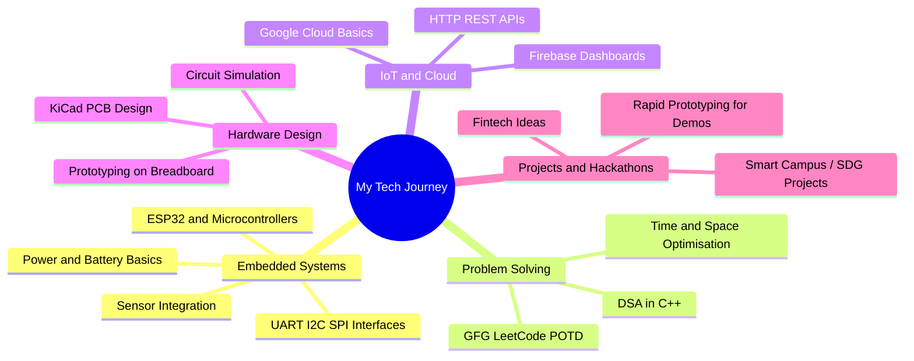

# Hi there! 👋 I'm Barath R

<div align="center">
  
  
  
  [](https://www.linkedin.com/barath0508)
  [](https://github.com/barath0508)
  [](mailto:barath5727@gmail.com)
  
</div>

---

## 🤖 About Me

> *"Building smart, reliable systems from code to circuits"*

I'm an **Electronics / Embedded Systems Enthusiast** based in **Chennai, Tamil Nadu, India**, passionate about **IoT**, **embedded development**, and **problem solving** through technology. I enjoy working on projects that blend **hardware**, **firmware**, and **software**, and I actively participate in **coding challenges** and **hackathons** to sharpen my skills.

```python
class EmbeddedEngineer:
    def __init__(self):
        self.name = "Barath R"
        self.role = "Electronics & Embedded Systems Enthusiast"
        self.location = "Chennai, Tamil Nadu, India"
        self.education = "B.E/B.Tech in Electronics (in progress)"
        self.passion = ["Embedded Systems", "IoT", "Problem Solving"]
        
    def current_focus(self):
        return [
            "ESP32 & Microcontroller Projects",
            "Data Structures and Algorithms",
            "IoT and Cloud Integration",
            "PCB Design and Circuit Simulation"
        ]
        
    def life_motto(self):
        return "Learn, build, and iterate every day"
```

---

## 🎓 Education

<table>
<tr>
<td>

**🎯 Current Studies**
- 🏛️ **Engineering College (Electronics-related branch)**  
  B.E/B.Tech in Electronics/Communication/Related Domain  
  📍 **Chennai, Tamil Nadu**

</td>
<td>

**📚 Interests in Learning**
- ⚡ Advanced Embedded Systems  
- 🔌 IoT Architectures and Cloud  
- 🧠 Algorithms & Competitive Programming  
- 📡 Communication and Networking Basics  

</td>
</tr>
</table>

---

## 💼 Experience & Activities

### 💻 Competitive Programming & Challenges
- 🚀 Actively solving **POTD** on **GeeksforGeeks / LeetCode / HackerRank**
- 📈 Participating in long-term coding streaks (e.g., **GFG × NPCI 60 Days POTD Challenge**)
- 🧠 Focused on **DSA**, **problem solving**, and **optimised C++/Python solutions**

### 🛠 Hackathons & Projects
- 🧪 Building **IoT** and **embedded** prototypes using **ESP32 / Arduino**
- 🧩 Interested in **fintech**, **smart systems**, and **SDG-focused** hackathon ideas
- 📊 Comfortable preparing **technical reports** and **presentations** for projects

---

## 🛠️ Technical Arsenal

<div align="center">

### 💻 Programming Languages


### 🔧 Tools & Frameworks


### 🌐 Web & Cloud


</div>

---

## 📊 Skills Proficiency

<div align="center">

| Skill                    | Level           |
|--------------------------|-----------------||
| **C++ / DSA**            | Proficient      |
| **Python**               | Proficient      |
| **Embedded C / ESP32**   | Proficient      |
| **IoT (HTTP/MQTT, APIs)**| Intermediate    |
| **Web Dev (HTML/CSS/JS)**| Intermediate    |
| **PCB Design (KiCad)**   | Intermediate    |
| **Machine Learning (Basic)** | Beginner   |

</div>

---

## 🧠 Soft Skills

<div align="center">

| Skill            | Description |
|------------------|-------------|
| 🧩 **Problem-Solving** | Enjoy tackling coding challenges and debugging complex issues |
| 📚 **Continuous Learning** | Regularly explore new tools, stacks, and project ideas |
| 🕒 **Consistency** | Maintaining coding streaks and project discipline |
| 🤝 **Collaboration** | Comfortable working in teams during hackathons and projects |

</div>

---

## 🚀 Selected Projects

> Replace the placeholders below with your actual projects as you build and push them.

### 🔌 Embedded & IoT Projects

#### 🌱 Smart Environment Monitor (ESP32)
- Real-time monitoring of sensors (e.g., gas, flame, soil moisture, temperature)
- Cloud/dashboard integration for visualization
- Alert or automation logic using relays/buzzers

#### 📦 Warehouse / Inventory Helper
- Barcode or RFID-based tracking concept
- Simple web/app interface for logging and viewing items
- Focus on **low-cost hardware** and **easy deployment**

#### 💡 Repair-Now-Pay-Later (Fintech Idea)
- Concept for **BNPL-style repair service** for small devices and appliances
- Targets students and small shop owners
- Scope for UPI-based **micro-EMI** implementation

### 🌐 Web & Automation Projects

#### 📊 Coding Progress Dashboard
- Tracks daily solved problems or streaks
- Simple web UI backed by a sheet / database / GitHub data

#### 🧠 DSA Practice Tracker
- Logs problems solved across platforms
- Categorizes by topic and difficulty for revision

---

## 🎯 Current Focus Areas



---

## 🤝 Let's Connect!

<div align="left">

💬 **I'm always excited to talk about:**
- ⚡ **Embedded systems** and microcontroller projects  
- 🌐 **IoT** architectures and real-world applications  
- 🧮 **DSA / problem solving** and coding challenges  
- 🚀 **Hackathons** and project ideas

**📧 Reach out:** [youremail@example.com](mailto:youremail@example.com)  

</div>

---

<div align="center">


[](https://github.com/barath0508)

**⭐ If you like my work, consider following my GitHub!**

</div>
