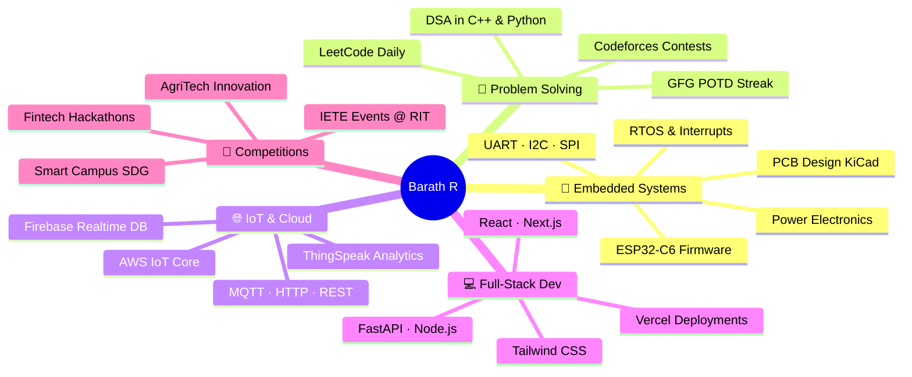

<!-- ╔══════════════════════════════════════════════════════════════╗ -->
<!-- ║              BARATH R — GITHUB PROFILE README               ║ -->
<!-- ╚══════════════════════════════════════════════════════════════╝ -->


<div align="center">

<!-- Typing Animation -->
<a href="https://git.io/typing-svg">
  
</a>

<br/>

<!-- Social Badges -->
<p>
  <a href="https://www.linkedin.com/in/barath-r-12773432b/">
    
  </a>
  <a href="https://github.com/barath0508">
    
  </a>
  <a href="mailto:barath5727@gmail.com">
    
  </a>
  <a href="https://barath0508-portfolio.vercel.app">
    
  </a>
</p>

<!-- Profile Metrics Row -->
<p>
  
  
  
  
</p>

</div>

---

<!-- ══════════════════════  ABOUT ME  ══════════════════════ -->

##  &nbsp;About Me


```python
class BarathR:

    name       = "Barath R"
    role       = "Electronics & Embedded Systems Enthusiast"
    location   = "Chennai, Tamil Nadu 🇮🇳"
    education  = "B.E ECE @ Rajalakshmi Institute of Technology"
    reg_no     = "2117240040013"
    
    languages  = ["C", "C++", "Python", "JavaScript"]
    hardware   = ["ESP32-C6", "Arduino", "Sensors", "OLED/I2C"]
    protocols  = ["UART", "I2C", "SPI", "MQTT", "HTTP/REST"]
    
    interests  = [
        "Embedded Systems & Firmware",
        "IoT Architecture & Cloud",
        "Competitive Programming (DSA)",
        "PCB Design & Prototyping",
        "Fintech & AgriTech Hackathons"
    ]

    def motto(self):
        return "Build from silicon to cloud. ⚡"
```

<br clear="right"/>

<br/>

<table align="center" width="100%">
<tr>
<td align="center" width="33%">

🔭 &nbsp;**Currently Building**<br/>
Power monitoring systems<br/>with ESP32 + OLED

</td>
<td align="center" width="33%">

🌱 &nbsp;**Currently Learning**<br/>
RTOS, LoRaWAN mesh<br/>& Advanced DSA

</td>
<td align="center" width="34%">

💬 &nbsp;**Ask Me About**<br/>
ESP32, IoT dashboards,<br/>LeetCode strategies

</td>
</tr>
<tr>
<td align="center">

⚡ &nbsp;**Fun Fact**<br/>
I debug hardware<br/>and code simultaneously

</td>
<td align="center">

🏆 &nbsp;**Hackathons**<br/>
Built KISAN PAY —<br/>offline UPI for rural India

</td>
<td align="center">

📍 &nbsp;**Open To**<br/>
Internships, freelance<br/>& collabs worldwide

</td>
</tr>
</table>

<br/>

<!-- Section Divider -->


---

<!-- ══════════════════════  TECH STACK  ══════════════════════ -->

## 🛠️ &nbsp;Tech Stack & Tools

<div align="center">

### 💻 &nbsp;Languages
<p>
  
</p>

### ⚙️ &nbsp;Embedded & Hardware
<p>
  
  
  
  
  
  
</p>

### 🌐 &nbsp;Web & Frontend
<p>
  
</p>

### 🔧 &nbsp;Backend & APIs
<p>
  
  
  
  
</p>

### ☁️ &nbsp;Cloud & DevOps
<p>
  
  
</p>

### 🗃️ &nbsp;Databases
<p>
  
</p>

</div>

---

<!-- ══════════════════════  GITHUB STATS  ══════════════════════ -->

## 📊 &nbsp;GitHub Analytics

<div align="center">


</div>

<div align="center">


</div>

---

<!-- ══════════════════════  TROPHIES  ══════════════════════ -->

## 🏆 &nbsp;GitHub Trophies

<div align="center">


</div>

---

<!-- ══════════════════════  LEETCODE  ══════════════════════ -->

## 🧩 &nbsp;LeetCode Stats

<div align="center">


<br/><br/>


&nbsp;

&nbsp;


</div>

---

<!-- ══════════════════════  PROJECTS  ══════════════════════ -->

## 🚀 &nbsp;Featured Projects

<div align="center">

<table>
<tr>
<td width="50%" valign="top">

### ⚡ POWER GUARD
**ESP32-C6 Smart Power Monitor**

```
🔹 SH1106 OLED display (GME12864-78)
🔹 ThingSpeak cloud integration  
🔹 Relay control on GPIO10
🔹 10-phase animated boot sequence
🔹 Real-time energy analytics
```


</td>
<td width="50%" valign="top">

### 🌾 KISAN PAY
**Offline-First AgriTech Payment Terminal**

```
🔹 UPI/AEPS + Aadhaar biometrics
🔹 LoRaWAN mesh for rural coverage
🔹 Blockchain e-WRS on Polygon PoS
🔹 Kisan Score credit system
🔹 FastAPI + AWS IoT Core backend
```


</td>
</tr>
<tr>
<td width="50%" valign="top">

### 🌡️ THERMAL IoT DASHBOARD
**Industrial Monitoring Node**

```
🔹 ESP32 + HiveMQ MQTT broker
🔹 React frontend with useMqtt hook
🔹 ThingSpeak HTTP polling fallback
🔹 Real-time sensor visualization
🔹 Alert thresholds & notifications
```


</td>
<td width="50%" valign="top">

### ⚡ ENERGIZE 2026
**Smart Energy Mini Hackathon**

```
🔹 IETE-ISF @ RIT, April 21 2026
🔹 ₹12,000 prize pool, 2 tracks
🔹 Software: Algorithmic Grid
🔹 Hardware: Kinetic Circuit
🔹 Next.js event website on Vercel
```


</td>
</tr>
</table>

</div>

---

<!-- ══════════════════════  ACTIVITY GRAPH  ══════════════════════ -->

## 📈 &nbsp;Contribution Activity

<div align="center">

[](https://github.com/ashutosh00710/github-readme-activity-graph)

</div>

---

<!-- ══════════════════════  SNAKE  ══════════════════════ -->

## 🐍 &nbsp;Contribution Snake

<div align="center">

<picture>
  <source media="(prefers-color-scheme: dark)" srcset="https://raw.githubusercontent.com/barath0508/barath0508/output/github-contribution-grid-snake-dark.svg"/>
  <source media="(prefers-color-scheme: light)" srcset="https://raw.githubusercontent.com/barath0508/barath0508/output/github-contribution-grid-snake.svg"/>
  
</picture>


</div>

---

<!-- ══════════════════════  SKILLS RADAR  ══════════════════════ -->

## 🎯 &nbsp;Current Focus & Roadmap


```mermaid
mindmap
  root((Barath R))
    🔌 Embedded Systems
      ESP32-C6 Firmware
      RTOS & Interrupts
      UART · I2C · SPI
      PCB Design KiCad
      Power Electronics
    🧠 Problem Solving
      LeetCode Daily
      GFG POTD Streak
      Codeforces Contests
      DSA in C++ & Python
    🌐 IoT & Cloud
      MQTT · HTTP · REST
      ThingSpeak Analytics
      AWS IoT Core
      Firebase Realtime DB
    💻 Full-Stack Dev
      React · Next.js
      FastAPI · Node.js
      Tailwind CSS
      Vercel Deployments
    🚀 Competitions
      Fintech Hackathons
      Smart Campus SDG
      AgriTech Innovation
      IETE Events @ RIT
```

---

<!-- ══════════════════════  EDUCATION  ══════════════════════ -->

## 🎓 &nbsp;Education

<div align="center">

| | |
|---|---|
| 🏛️ **Institution** | Rajalakshmi Institute of Technology, Chennai |
| 📚 **Degree** | B.E — Electronics & Communication Engineering |
| 🆔 **Register No.** | 2117240040013 |
| 🏢 **Club** | IETE Students' Forum (ISF) — Executive Technical |
| 📍 **Location** | Chennai, Tamil Nadu, India |

</div>

---

<!-- ══════════════════════  SOFT SKILLS  ══════════════════════ -->

## 🧠 &nbsp;What I Bring

<div align="center">

| 🧩 Problem Solver | 🔁 Consistent | 🤝 Team Player | 🚀 Self-Starter |
|:---:|:---:|:---:|:---:|
| Debugging hardware AND code simultaneously | Daily coding streaks & project discipline | Hackathon collaborator & event organizer | From idea → prototype → deployed product |

</div>

---

<!-- ══════════════════════  CONNECT  ══════════════════════ -->

## 🤝 &nbsp;Let's Connect & Build Together

<div align="center">

<a href="https://www.linkedin.com/in/barath-r-12773432b/">
  
</a>
&nbsp;
<a href="mailto:barath5727@gmail.com">
  
</a>
&nbsp;
<a href="https://barath0508-portfolio.vercel.app">
  
</a>

<br/><br/>

> 💬 *Open to IoT collaborations, full-stack freelance, embedded firmware gigs & hackathon teams*

</div>

---

<!-- Footer Wave -->


<div align="center">

<sub>⭐ <b>Star my repos if you find them useful!</b> • Built with 🔌 Hardware + 💻 Software + ☕ Coffee</sub>

</div>
