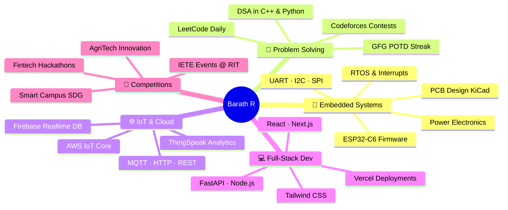

<!-- ╔══════════════════════════════════════════════════════════════╗ -->
<!-- ║              BARATH R — GITHUB PROFILE README               ║ -->
<!-- ╚══════════════════════════════════════════════════════════════╝ -->


<div align="center">

<!-- Typing Animation -->
<a href="https://git.io/typing-svg">
  
</a>

<br/>

<!-- Social Badges -->
<p>
  <a href="https://www.linkedin.com/in/barath-r-12773432b/">
    
  </a>
  <a href="https://github.com/barath0508">
    
  </a>
  <a href="mailto:barath5727@gmail.com">
    
  </a>
  <a href="https://barath0508-portfolio.vercel.app">
    
  </a>
  <a href="https://barath0508.github.io/barath0508/">
    
  </a>
  <a href="https://barath0508.github.io/barath0508/resume.pdf">
    
  </a>
  <a href="https://barath0508.github.io/barath0508/resume_full.pdf">
    
  </a>
</p>

<!-- Profile Metrics Row -->
<p>
  
  
  
  
</p>

</div>

---

<!-- ══════════════════════  ABOUT ME  ══════════════════════ -->

##  &nbsp;About Me

> *"Third-year Electronics and Communication Engineering student and Embedded Engineer with hands-on proficiency across hardware design, bare-metal firmware, and software engineering. Experienced in building from silicon to software — from register-level RISC-V assembly and custom PCB/sensor bring-up to full-stack IoT telemetry pipelines, cloud integration, and algorithmic problem solving."*

<br/>


```python
class BarathR:

    name       = "Barath R"
    role       = "Embedded Engineer | Full-Stack & IoT Systems"
    location   = "Chennai, Tamil Nadu 🇮🇳"
    education  = "B.E ECE @ Rajalakshmi Institute of Technology (2024-2028)"
    reg_no     = "2117240040013"
    cgpa       = "8.65 / 10"
    
    languages  = ["C", "C++", "Python", "JavaScript (ES6+)", "TypeScript", "RISC-V Assembly", "SQL"]
    hardware   = ["ESP32-C6", "ESP32", "ESP32-CAM", "Raspberry Pi 5", "Arduino UNO R3", "Altera DE2 FPGA", "Bare-Metal MMIO"]
    pcb_eda    = ["KiCad", "Proteus", "EasyEDA", "Multi-Layer Routing", "DRC/ERC", "Gerber Generation", "SMD/THT Soldering"]
    protocols  = ["I2C", "SPI", "UART", "MQTT", "LoRaWAN", "GPIO/PWM/ADC", "MMIO", "WebSockets", "HTTP/REST"]
    
    interests  = [
        "Bare-Metal Firmware & RISC-V Architecture",
        "High-Speed IoT Telemetry & Cloud Pipelines",
        "Custom PCB Design, Prototyping & Bring-up",
        "Defense RF & Antenna Arrays (SIH 2026)",
        "Competitive Programming & DSA (LeetCode Streak)"
    ]

    def motto(self):
        return "Build from silicon to cloud. ⚡"
```

<br clear="right"/>

<br/>

<table align="center" width="100%">
<tr>
<td align="center" width="33%">

🔭 &nbsp;**Currently Building**<br/>
ESP32-C6 firmware & power<br/>monitoring systems with OLED

</td>
<td align="center" width="33%">

🌱 &nbsp;**Currently Learning**<br/>
RTOS, LoRaWAN mesh<br/>& Advanced DSA

</td>
<td align="center" width="34%">

💬 &nbsp;**Ask Me About**<br/>
ESP32, IoT dashboards,<br/>LeetCode strategies

</td>
</tr>
<tr>
<td align="center">

⚡ &nbsp;**Fun Fact**<br/>
I debug hardware<br/>and code simultaneously

</td>
<td align="center">

🏆 &nbsp;**Hackathons**<br/>
Built KISAN PAY —<br/>offline UPI for rural India

</td>
<td align="center">

📍 &nbsp;**Open To**<br/>
Internships, freelance<br/>& collabs worldwide

</td>
</tr>
</table>

<br/>

<!-- Section Divider -->


---

<!-- ══════════════════════  TECH STACK  ══════════════════════ -->

## 🛠️ &nbsp;Tech Stack & Tools

<div align="center">

### 💻 &nbsp;Languages
<p>
  
  
  
</p>

### ⚙️ &nbsp;Embedded & Hardware
<p>
  
  
  
  
  
  
  
  
</p>

### 🌐 &nbsp;Web & Frontend
<p>
  
  
  
</p>

### 🔧 &nbsp;Backend & APIs
<p>
  
  
  
  
</p>

### ☁️ &nbsp;Cloud & DevOps
<p>
  
  
</p>

### 🗃️ &nbsp;Databases
<p>
  
</p>

<br/>

<details open>
<summary><b>📋 &nbsp;Comprehensive Technical Skills Matrix (from Resume)</b></summary>
<br/>

| Domain | Competencies & Tools |
|:---|:---|
| 🔌 **Hardware & Embedded** | ESP32, ESP32-C6, ESP32-CAM, Raspberry Pi 5, Arduino UNO R3, Altera DE2 FPGA, Bare-Metal MMIO, CST Studio, Keysight ADS |
| 📐 **PCB Design & EDA** | KiCad, Proteus, EasyEDA, Schematic Capture, Multi-Layer PCB Layout, Routing, DRC/ERC, Gerber & BOM Generation, SMD/THT Soldering, Hardware Bring-up |
| 📡 **Hardware Protocols** | I2C, SPI, UART, MQTT, LoRaWAN, GPIO, PWM, ADC, MMIO, WebSockets, HTTP/REST |
| 💻 **Programming Languages** | C, C++, Python, JavaScript (ES6+), TypeScript, Java, SQL, RISC-V Assembly |
| 🌐 **Software & Web Dev** | React.js, Next.js, Node.js, Express.js, FastAPI, Flask, HTML5, CSS3, Tailwind CSS, WebAssembly, REST APIs |
| ☁️ **Cloud, IoT & BaaS** | Firebase, HiveMQ, ThingSpeak, AWS IoT Core, Google Cloud Platform, Supabase |
| 🗃️ **Databases** | MongoDB, PostgreSQL, MySQL, SQLite, Supabase |
| 🛠️ **Engineering Tools & DevOps** | Git, GitHub Actions, Docker, Linux/Bash, ESP-IDF (v6), VS Code, PlatformIO, MATLAB, Scilab, ADB |
| 🧠 **Core CS & Architecture** | Data Structures & Algorithms (LeetCode streak), OOP, Concurrency, RTOS Architecture |

</details>

</div>

---

<!-- ══════════════════════  GITHUB STATS  ══════════════════════ -->

## 📊 &nbsp;GitHub Analytics

<div align="center">


</div>

<div align="center">


</div>

---

<!-- ══════════════════════  TROPHIES  ══════════════════════ -->

## 🏆 &nbsp;GitHub Trophies

<div align="center">


</div>

---

<!-- ══════════════════════  LEETCODE  ══════════════════════ -->

## 🧩 &nbsp;LeetCode Stats

<div align="center">


<br/><br/>


&nbsp;

&nbsp;


</div>

---

<!-- ══════════════════════  PROJECTS  ══════════════════════ -->

## 🚀 &nbsp;Featured Projects & Creations

<div align="center">

<p>
  <a href="https://barath0508-portfolio.vercel.app">
    
  </a>
</p>

### 🌐 &nbsp;Flagship Web & SaaS Applications

<table width="100%">
<tr>
<td width="50%" valign="top">

### 📄 iCreatePDF
**100% Client-Side Privacy PDF Suite** &nbsp; 

Privacy-first document suite with 37+ tools running entirely in-browser via WebAssembly & Web Workers — absolute zero server uploads.

```
🔹 100% Client-side processing with zero server uploads
🔹 37+ PDF tools: Merge, split, compress, booklet imposition
🔹 Sub-second in-memory execution via WebAssembly & Web Workers
🔹 Production deployment with custom domain (icreatepdf.online)
```


<br/>

<a href="https://github.com/barath0508/iCreatePDF"></a>
&nbsp;
<a href="https://icreatepdf.online"></a>

</td>
<td width="50%" valign="top">

### 📱 QRLoop
**Dynamic QR & Real-Time Scan Analytics** &nbsp; 

Full-stack dynamic QR platform enabling post-print destination redirection with comprehensive scan geolocation and device telemetry.

```
🔹 Dynamic QR redirection allowing URL updates post-print
🔹 Real-time scan telemetry: Device type, referrer & timestamp
🔹 Secure JWT authentication with express-rate-limit protection
🔹 Custom canvas engine for colors, logos & dot-matrix styling
```


<br/>

<a href="https://github.com/barath0508/QR"></a>
&nbsp;
<a href="https://qrloop-eight.vercel.app"></a>

</td>
</tr>
<tr>
<td width="50%" valign="top">

### 🏛️ IETE-RIT Portal
**Official Student Forum Platform** &nbsp; 

Official web platform for the IETE Student Forum at Rajalakshmi Institute of Technology with an interactive 3D digital globe and events management.

```
🔹 Custom interactive 3D digital globe rendering via Three.js
🔹 GSAP timeline choreography, magnetic cursors & smooth transitions
🔹 Technical symposium, hackathon & workshop event registrations
🔹 Executive committee directory & active student showcase
```


<br/>

<a href="https://github.com/barath0508/IETE-RIT"></a>
&nbsp;
<a href="https://iete-rit.vercel.app"></a>

</td>
<td width="50%" valign="top">

### ⚡ Energize 2026
**Smart Energy Hackathon & 3D Digital Twin** &nbsp; 

Official flagship website for the Energize 2026 national technical hackathon featuring an interactive 3D Digital Twin model and ambient Web Audio soundscape.

```
🔹 Interactive 3D Digital Twin model rendered in Three.js
🔹 GSAP timeline choreography & magnetic hover physics
🔹 Web Audio API ambient audio state machine with persistent state
🔹 Hosted by IETE-ISF @ Rajalakshmi Institute of Technology
```


<br/>

<a href="https://github.com/barath0508/energize2026"></a>
&nbsp;
<a href="https://energize2026.vercel.app"></a>

</td>
</tr>
</table>

<br/>

### 🔌 &nbsp;Embedded Systems, IoT & Hardware Engineering

<table width="100%">
<tr>
<td width="50%" valign="top">

### ⚡ FlashESP
**Web Serial ESP32 Flasher & In-Browser IDE** &nbsp; 

Direct in-browser ESP32 firmware flasher eliminating desktop driver chains using Web Serial API, esptool-js, Monaco Editor, and serial telemetry.

```
🔹 In-browser firmware flashing via Web Serial API & esptool-js
🔹 Integrated Monaco Editor with C/C++ firmware highlighting
🔹 Real-time serial baud rate monitoring & telemetry terminal log
🔹 Zero desktop driver or toolchain installations required
```


<br/>

<a href="https://github.com/barath0508/Esp_Flash_Tool"></a>

</td>
<td width="50%" valign="top">

### ☀️ Solar Tracker 3D
**Real-Time Telemetry & 3D WebGL Simulation** &nbsp; 

Interactive 3D dual-axis solar tracking station with React Three Fiber, geospatial Leaflet mapping, and Supabase real-time telemetry streaming.

```
🔹 Real-time 3D solar array orientation rendering via R3F
🔹 Supabase live channels for low-latency telemetry streaming
🔹 Real-time solar azimuth and sun elevation angle calculations
🔹 Geospatial solar farm mapping integration with Leaflet
```


<br/>

<a href="https://github.com/barath0508/Solar_Tracker"></a>
&nbsp;
<a href="https://solar-tracker-pi-jade.vercel.app"></a>

</td>
</tr>
<tr>
<td width="50%" valign="top">

### 🔌 POWER GUARD
**ESP32-C6 Smart Power Monitor & Embedded Firmware** &nbsp; 

Real-time AC power intelligence system and low-level firmware engineered on the ESP32-C6 RISC-V microcontroller with modular I2C display drivers, automated overcurrent relay protection, and IoT cloud telemetry.

```
🔹 Embedded C++ & ESP-IDF firmware for real-time AC voltage & current telemetry
🔹 Modular SH1106 OLED display driver (GME12864-78 over I2C) with diagnostics
🔹 Relay control & automated overload cut-off protection on GPIO10
🔹 10-phase animated boot sequence, health checks & ThingSpeak cloud integration
```


<br/>

<a href="https://github.com/barath0508"></a>

</td>
<td width="50%" valign="top">

### 🌾 KISAN PAY
**Offline-First AgriTech Payment Terminal** &nbsp; 

Decentralized rural payment terminal combining biometric Aadhaar authentication, LoRaWAN mesh communication, and Polygon blockchain.

```
🔹 Dual UPI / AEPS + Aadhaar biometric authentication
🔹 LoRaWAN mesh protocol for remote zero-internet coverage
🔹 Blockchain electronic Warehouse Receipts (e-WRS) on Polygon
🔹 Kisan Score proprietary credit assessment & microfinance
```


<br/>

<a href="https://github.com/barath0508"></a>

</td>
</tr>
<tr>
<td width="50%" valign="top">

### 🏷️ ESP32 Smart Attendance
**IoT Telemetry & Web Dashboard** &nbsp; 

Automated campus attendance management station engineered with ESP32 Wi-Fi microcontrollers and high-availability cloud dashboard.

```
🔹 Automated wireless attendance capture via ESP32 Wi-Fi
🔹 Instant verification packet ingestion to cloud with low latency
🔹 Live responsive check-in telemetry dashboard on Vercel
🔹 Hardware-level debounce filtering & multi-color status LEDs
```


<br/>

<a href="https://github.com/barath0508/esp32-attendance"></a>
&nbsp;
<a href="https://esp32-attendance.vercel.app"></a>

</td>
<td width="50%" valign="top">

### ⚙️ Bare-Metal RISC-V Scheduler
**Trap Handler & Preemptive Context Switcher** &nbsp; 

Low-level preemptive context switcher and trap handling engine implemented directly in assembly with no RTOS or vendor abstraction layers.

```
🔹 Preemptive timer-based context switcher in RISC-V assembly
🔹 Zero RTOS, no vendor SDK abstraction layers — pure bare-metal
🔹 Direct MMIO register configuration for timer interrupts
🔹 Stack frame preservation and register-level task scheduling
```


<br/>

<a href="https://github.com/barath0508"></a>

</td>
</tr>
</table>

<br/>

### 📡 &nbsp;Defense Tech, RF, Digital Twins & Hardware Systems

<table width="100%">
<tr>
<td width="50%" valign="top">

### 📡 Conformal Helmet Antenna
**Smart India Hackathon 2026 · Defense RF** &nbsp; 

Flexible microstrip patch antenna array embedded on ballistic helmets for NSG CQB/CT operations, replacing bulky snag-prone whip antennas.

```
🔹 Embedded microstrip patch array eliminating whip snagging
🔹 Dual-band RF: UHF (tactical radio) + L-band (video link)
🔹 Integrated RF shielding layer minimizing SAR to operator's head
🔹 Upward/outward directional radiation pattern for maximum range
🔹 Ruggedized coax interface preserving helmet ballistic rating
```


<br/>

<a href="https://github.com/barath0508"></a>

</td>
<td width="50%" valign="top">

### 🚦 Altera FPGA Traffic FSM
**Verilog Digital Hardware Synthesis** &nbsp; 

Synthesized digital finite state machine in Verilog HDL for adaptive 4-way traffic junctions with hardware clock division and priority override.

```
🔹 Adaptive 4-way traffic junction finite state machine in Verilog
🔹 Hardware clock divider pipelines for realistic timing phases
🔹 Emergency vehicle sensor priority override logic
🔹 Simulated and verified with Altera Quartus and ModelSim
```


<br/>

<a href="https://github.com/barath0508/Traffic_Light_Altera"></a>

</td>
</tr>
<tr>
<td width="50%" valign="top">

### 🏭 Digital Twin for Industrial Monitoring
**5G-Integrated IoT Telemetry Node** &nbsp; 

Industrial digital twin platform connecting multi-sensor edge nodes via 5G connectivity for real-time equipment telemetry and predictive maintenance.

```
🔹 Industrial digital twin connecting multi-sensor edge nodes via 5G
🔹 High-frequency telemetry pipeline for predictive equipment health
🔹 Cloud data ingestion & responsive dashboard in Python & React
🔹 Bridges sensor-level physical acquisition to software analytics
```


<br/>

<a href="https://github.com/barath0508"></a>

</td>
<td width="50%" valign="top">

### ☀️ Dual-Axis Solar Tracker (Hardware)
**Closed-Loop Embedded Control System** &nbsp; 

Physical dual-axis solar tracker constructed to maximize photovoltaic panel yield using an analog LDR sensor bridge and closed-loop motor control.

```
🔹 Dual-axis solar tracking maximizing photovoltaic panel yield
🔹 Closed-loop feedback using precision analog LDR sensor bridge
🔹 Custom sensor interfacing & motor driver PCB with voltage regulation
🔹 Precision continuous azimuth and elevation tracking in C/C++
```


<br/>

<a href="https://github.com/barath0508"></a>

</td>
</tr>
</table>

<br/>

### 🧠 &nbsp;AI / ML & Intelligent Systems

<table width="100%">
<tr>
<td width="50%" valign="top">

### 🩺 HealthLink
**Gemini AI Healthcare & Donor Network** &nbsp; 

Healthcare platform unifying emergency blood donor mapping, verified hospital directories, and instant symptom triage powered by Google Gemini GenAI.

```
🔹 Google Gemini GenAI for instant emergency triage assistance
🔹 Real-time blood donor and hospital availability mapping
🔹 Dynamic QR code generation for medication & prescription verification
🔹 Full-stack responsive application backed by Supabase
```


<br/>

<a href="https://github.com/barath0508/Health-Link"></a>

</td>
<td width="50%" valign="top">

### 💬 Medical Advisor Chatbot
**NLP-Powered Clinical Symptom Triage** &nbsp; 

Conversational healthcare triage agent providing preliminary medical guidance by parsing symptoms with NLP tokenization and rapid ML classifiers.

```
🔹 Natural Language Processing pipeline for symptom extraction
🔹 Real-time conversational interface with triage logic
🔹 Flask REST API backend coupled with modern lightweight frontend
🔹 Fast, zero-latency inference for preliminary guidance
```


<br/>

<a href="https://github.com/barath0508/AIML---Chatbot"></a>
&nbsp;
<a href="https://medicode4.netlify.app"></a>

</td>
</tr>
<tr>
<td width="50%" valign="top">

### 🎓 AI Academic Advisor
**OCR & GPA Forecast Engine** &nbsp; 

Decision-support platform that evaluates marksheet transcripts using Tesseract OCR, forecasts GPA with regression models, and matches scholarships.

```
🔹 Automated marksheet digitisation using Tesseract OCR engine
🔹 Predictive GPA regression modeling based on semester trends
🔹 Personalized elective recommendations based on skill vectors
🔹 Automated scholarship eligibility pattern matching algorithm
```


<br/>

<a href="https://github.com/barath0508"></a>

</td>
<td width="50%" valign="top">

### 🔥 Roast as a Service
**Humorous AI Developer Review Utility** &nbsp; 

Satirical developer entertainment utility generating clever, lighthearted code roasts and performance commentary with ultra-snappy reactive feedback.

```
🔹 Ultra-snappy reactive client UI for instantaneous roasts
🔹 Humor engine synthesizing witty, satirical code commentary
🔹 Social share preview card generation for developer communities
🔹 Lightweight, high-performance Vite + Tailwind deployment
```


<br/>

<a href="https://github.com/barath0508/Roast-as-a-Serivice"></a>
&nbsp;
<a href="https://roast-as-a-serivice.vercel.app"></a>

</td>
</tr>
</table>

</div>

---

<!-- ══════════════════════  ACTIVITY GRAPH  ══════════════════════ -->

## 📈 &nbsp;Contribution Activity

<div align="center">

[](https://github.com/ashutosh00710/github-readme-activity-graph)

</div>

---

<!-- ══════════════════════  SNAKE  ══════════════════════ -->

## 🐍 &nbsp;Contribution Snake

<div align="center">

<picture>
  <source media="(prefers-color-scheme: dark)" srcset="https://raw.githubusercontent.com/barath0508/barath0508/output/github-contribution-grid-snake-dark.svg"/>
  <source media="(prefers-color-scheme: light)" srcset="https://raw.githubusercontent.com/barath0508/barath0508/output/github-contribution-grid-snake.svg"/>
  
</picture>


</div>

---

<!-- ══════════════════════  SKILLS RADAR  ══════════════════════ -->

## 🎯 &nbsp;Current Focus & Roadmap


```mermaid
mindmap
  root((Barath R))
    🔌 Embedded Systems
      ESP32-C6 Firmware
      RTOS & Interrupts
      UART · I2C · SPI
      PCB Design KiCad
      Power Electronics
    🧠 Problem Solving
      LeetCode Daily
      GFG POTD Streak
      Codeforces Contests
      DSA in C++ & Python
    🌐 IoT & Cloud
      MQTT · HTTP · REST
      ThingSpeak Analytics
      AWS IoT Core
      Firebase Realtime DB
    💻 Full-Stack Dev
      React · Next.js
      FastAPI · Node.js
      Tailwind CSS
      Vercel Deployments
    🚀 Competitions
      Fintech Hackathons
      Smart Campus SDG
      AgriTech Innovation
      IETE Events @ RIT
```

---

<!-- ══════════════════════  EXPERIENCE  ══════════════════════ -->

## 💼 &nbsp;Technical Experience & Leadership

<div align="center">

<table width="100%">
<tr>
<td width="50%" valign="top">

### 🏛️ Executive Technical Organizer
**IETE Students' Forum (ISF)** • *Rajalakshmi Institute of Technology*

```
🔹 Coordinated technical hackathons, symposiums & hardware workshops
🔹 Led technical design & website development for Energize 2026
🔹 Mentored students across software, embedded systems & PCB tracks
🔹 Organized peer coding sessions, project reviews & technical events
```


</td>
<td width="50%" valign="top">

### 🔌 Embedded Systems & Hardware Engineering
**End-to-End Prototyping & System Design** • *Independent & Academic*

```
🔹 End-to-end prototyping: Schematic capture to multi-layer PCB layout
🔹 Manual SMD/THT soldering, hardware bring-up & signal debugging
🔹 Bare-metal firmware development in C, C++ & RISC-V Assembly
🔹 Full-stack IoT telemetry pipelines, MQTT/HTTP brokers & cloud dashboards
```


</td>
</tr>
</table>

</div>

---

<!-- ══════════════════════  EDUCATION  ══════════════════════ -->

## 🎓 &nbsp;Education

<div align="center">

| Degree / Qualification | Institution | Duration | Score / Board |
|:---|:---|:---:|:---:|
| 🎓 **B.E. — Electronics & Communication Engineering** | Rajalakshmi Institute of Technology, Chennai | 2024 – 2028 *(Expected)* | **CGPA: 8.65 / 10**<br/><sub>Currently in 3rd Year</sub> |
| 🏫 **Higher Secondary Certificate (HSC — Class XII)** | Montfort Matriculation Higher Secondary School, Chennai | 2023 – 2024 | **95%**<br/><sub>Tamil Nadu State Board</sub> |
| 🏫 **Secondary School Leaving Certificate (SSLC — Class X)** | Montfort Matriculation Higher Secondary School, Chennai | 2021 – 2022 | **94%**<br/><sub>Tamil Nadu State Board</sub> |

<br/>

<table width="85%">
<tr>
<td align="center"><b>🆔 Register No:</b> <code>2117240040013</code></td>
<td align="center"><b>🏢 Technical Society:</b> IETE Students' Forum (ISF)</td>
<td align="center"><b>📍 Location:</b> Chennai, Tamil Nadu, India</td>
</tr>
</table>

</div>

---

<!-- ══════════════════════  SOFT SKILLS  ══════════════════════ -->

## 🧠 &nbsp;What I Bring

<div align="center">

| 🧩 Problem Solver | 🔁 Consistent | 🤝 Team Player | 🚀 Self-Starter |
|:---:|:---:|:---:|:---:|
| Debugging hardware AND code simultaneously | Daily coding streaks & project discipline | Hackathon collaborator & event organizer | From idea → prototype → deployed product |

</div>

---

<!-- ══════════════════════  CONNECT  ══════════════════════ -->

## 🤝 &nbsp;Let's Connect & Build Together

<div align="center">

<a href="https://www.linkedin.com/in/barath-r-12773432b/">
  
</a>
&nbsp;
<a href="mailto:barath5727@gmail.com">
  
</a>
&nbsp;
<a href="https://barath0508-portfolio.vercel.app">
  
</a>
&nbsp;
<a href="https://barath0508.github.io/barath0508/">
  
</a>
&nbsp;
<a href="https://barath0508.github.io/barath0508/resume.pdf">
  
</a>
&nbsp;
<a href="https://barath0508.github.io/barath0508/resume_full.pdf">
  
</a>

<br/><br/>

> 💬 *Open to IoT collaborations, full-stack freelance, embedded firmware gigs & hackathon teams*

</div>

---

<!-- Footer Wave -->


<div align="center">

<sub>⭐ <b>Star my repos if you find them useful!</b> • Built with 🔌 Hardware + 💻 Software + ☕ Coffee</sub>

</div>
